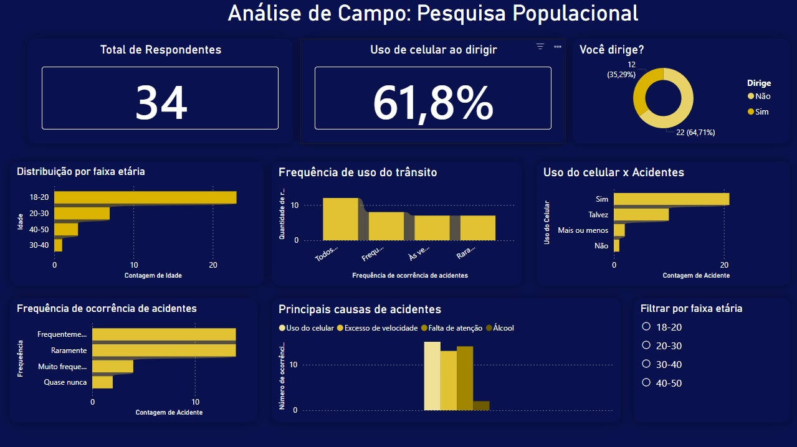

# pesquisa-transito-dashboard
Dashboard desenvolvido no Power BI a partir de uma pesquisa realizada via Google Forms sobre comportamento no trânsito e uso de celular ao dirigir. O projeto envolve coleta, tratamento e visualização de dados para geração de insights.

📊 Análise de Dados — Comportamento no Trânsito e Uso de Celular

Projeto de análise de dados desenvolvido no Power BI a partir de uma pesquisa realizada via Google Forms, com o objetivo de identificar padrões de comportamento no trânsito e possíveis fatores relacionados a acidentes.

---

🎯 Objetivo do Projeto

Analisar hábitos de motoristas e passageiros relacionados ao uso de celular no trânsito, utilizando dados reais coletados por meio de formulário online.

---

🛠 Ferramentas Utilizadas

- Power BI
- Excel
- Google Forms

---

📈 Principais Insights

- 61,8% dos participantes afirmaram utilizar celular ao dirigir;
- A faixa etária predominante da pesquisa foi entre 18 e 20 anos;
- O uso do celular apareceu entre os fatores mais associados aos acidentes;
- Os dados permitiram identificar padrões comportamentais e riscos relacionados à distração no trânsito.

---

📷 Dashboard

